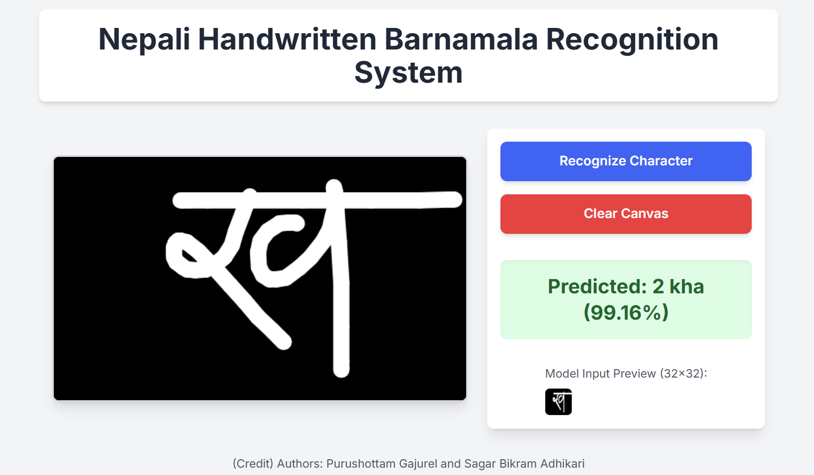
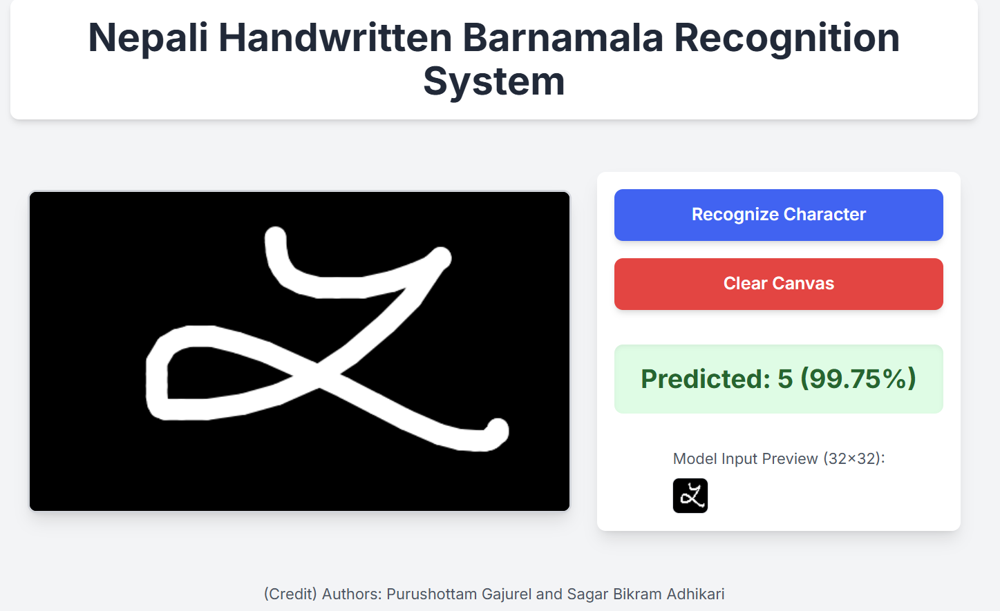

# Nepali Handwritten Barnamala Recognition System

## About the Project

This project develops a web-based application for recognizing handwritten Nepali Barnamala (alphabets and numerals). It leverages a Convolutional Neural Network (CNN) trained on the Devanagari Handwritten Character Dataset to achieve high accuracy in classifying handwritten characters drawn by users in real-time. The application is designed to be user-friendly, allowing users to input their handwritten characters and receive instant recognition.

The system aims to provide a simple, clean, and intuitive user interface for character drawing and instant recognition, demonstrating the power of deep learning in practical applications for Indic scripts.

## Demo

### Dataset Visualization


### Screenshots


_User drawing a character on the black canvas with a white pen._


_The system displaying the predicted character and confidence._

## Technologies Used

- **Frontend:**
  - HTML5
  - CSS3 (with [Tailwind CSS](https://tailwindcss.com/) for utility-first styling)
  - JavaScript
  - [TensorFlow.js](https://www.tensorflow.org/js) (for running the ML model in the browser)
- **Backend (Model Training):**
  - Python
  - [TensorFlow / Keras](https://www.tensorflow.org/keras) (for building and training the CNN)
  - [NumPy](https://numpy.org/) (for numerical operations)
  - [Pillow (PIL)](https://pillow.readthedocs.io/) (for image processing)
  - [Scikit-learn](https://scikit-learn.org/stable/) (for data splitting, evaluation metrics)
  - [cuML (RAPIDS)](https://rapids.ai/start.html) (for GPU-accelerated KNN and Random Forest experimentation)
  - [Matplotlib](https://matplotlib.org/) & [Seaborn](https://seaborn.pydata.org/) (for plotting)
  - Google Colab (for GPU-accelerated training environment)

## Model Performance

The core of this system is a Convolutional Neural Network (CNN) trained to classify 46 distinct Nepali characters (36 consonants and 10 numerals).

- **Overall Test Accuracy (CNN):** **98.19%**

This CNN significantly outperforms traditional machine learning models (K-Nearest Neighbors and Random Forest, both achieving ~91% accuracy) and surpasses the 93% average accuracy reported in previous research by Nyaupane et al. (2021) using SVM.

## Dataset

The model was trained on the **Devanagari Handwritten Character Dataset** from the UCI Machine Learning Repository.

- **Total Images:** 92,000 (32x32 pixel grayscale)
- **Classes:** 46 (10 numerals, 36 consonants)
- **Split:** 85% Training, 15% Testing

## Getting Started

To get a local copy up and running, follow these simple steps.

### Prerequisites

- A modern web browser (Chrome, Firefox, Edge, Safari).
- (Optional, but recommended for local development) [VS Code](https://code.visualstudio.com/) with the [Live Server](https://marketplace.visualstudio.com/items?itemName=ritwickdey.LiveServer) extension.

### Local Setup

1.  **Clone the repository:**
    ```bash
    git clone [https://github.com/purushottam061/Nepali-OCR]
    cd Nepali-OCR
    ```
2.  **Open in VS Code:**
    ```bash
    code .
    ```
3.  **Install Live Server (if not already installed):**
    Go to VS Code Extensions (Ctrl+Shift+X), search for "Live Server" by Ritwick Dey, and install it.
4.  **Run the application:**
    Right-click on `index.html` in the VS Code Explorer and select "Open with Live Server". Your browser will open the application.

## Usage

1.  **Wait for Model Loading:** Allow a few moments for the TensorFlow.js model to load (indicated by "Loading Model..." on the canvas).
2.  **Draw:** Use your mouse or touch (on mobile) to draw a Nepali character or numeral on the black canvas using the white "pen".
3.  **Recognize:** Click the "Recognize Character" button to get the model's prediction.
4.  **Clear:** Click the "Clear Canvas" button to erase your drawing and start fresh.

## Contributing

Contributions are welcome! If you have suggestions for improvements, feature requests, or bug reports, please open an issue or submit a pull request.

## Contact

- **Purushottam Gajurel** - [(https://github.com/purushottam061) (gajurealp@gmail.com)]
- **Sagar Bikram Adhikari** - [https://github.com/cyberviper37]

Project Link: [https://github.com/purushottam061/Nepali-OCR]

## Acknowledgements

- The Devanagari Handwritten Character Dataset from UCI Machine Learning Repository.
- TensorFlow.js and Keras for providing powerful deep learning tools.
- Nyaupane et al. (2021) for their foundational work and benchmark.
- Masrat et al. (2024) for their recent work that inspired further model enhancement.
